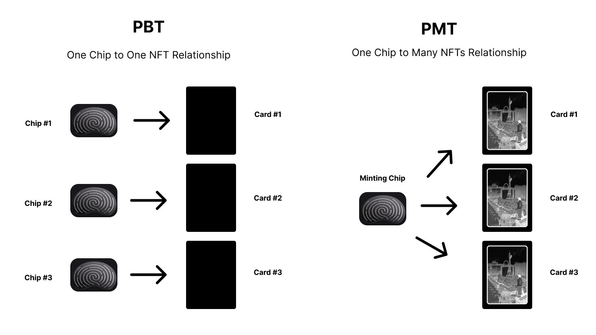

# Physically Minted Token - PMT

This repository provides sample code for creating a Physically Minted Token (PMT) utilizing an [ARX chip](https://arx.org/). A PMT is a form of a NFT contract, distinguished by its requirement for a signature generated by an NFC chip. This unique feature necessitates the physical presence of an individual for the minting process.

This code was written for [Bobu's Card Shop](https://twitter.com/0xNader/status/1671597728261099523) and inspired by [PBT](https://www.pbt.io/).

### Key Components

- **ARX Chip**: Stores a private key, which is used for the creation of unique signatures.
- **Frontend**: Responsible for initiating the process, it prompts the chip to generate a signature.
- **Server**: Acts as an intermediary, it receives the signatures from the frontend and facilitates the minting process.
- **NFT Contract**: Contains a mint function that is gated by a signature from the chip. This ensures security and authenticity of the minting process.

### SSL Requirement
Note: The `pbt-chip-client` library **must be** used with secure transport (SSL), even in a development environment. Meaning you will have trouble testing on localhost.
